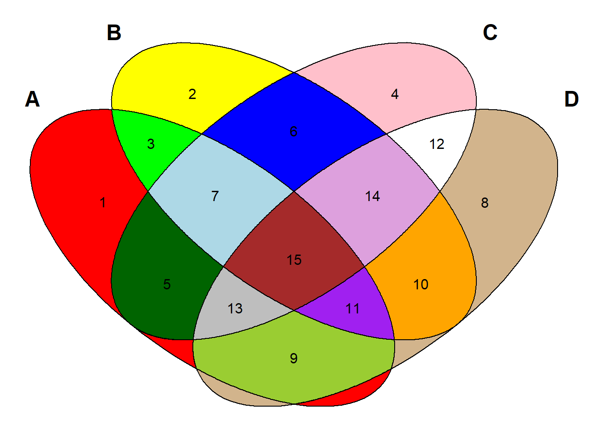
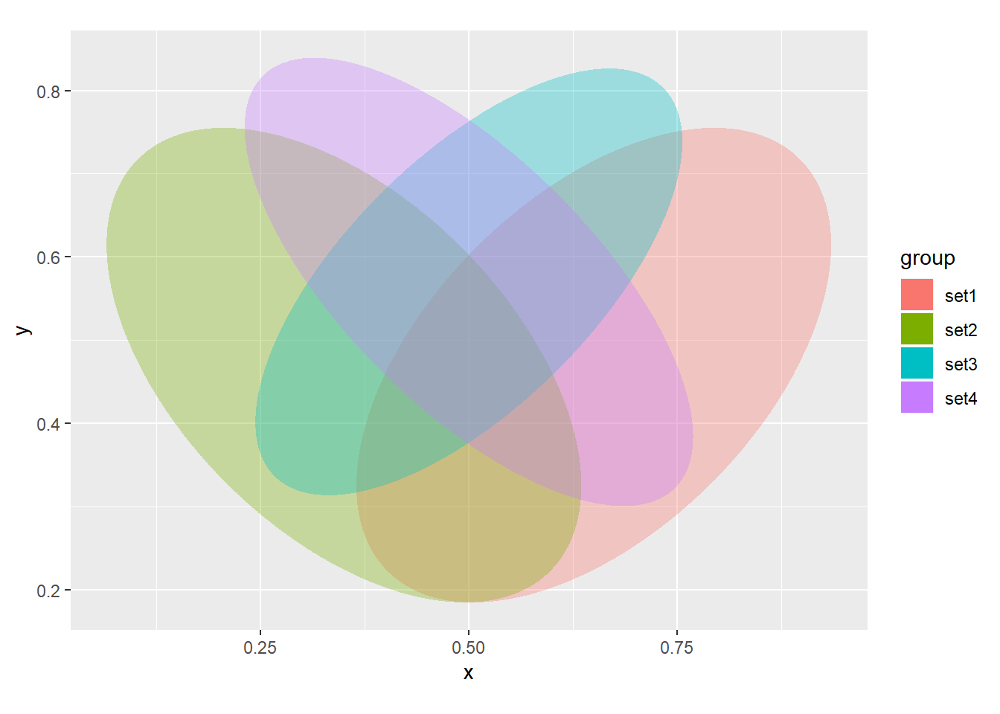
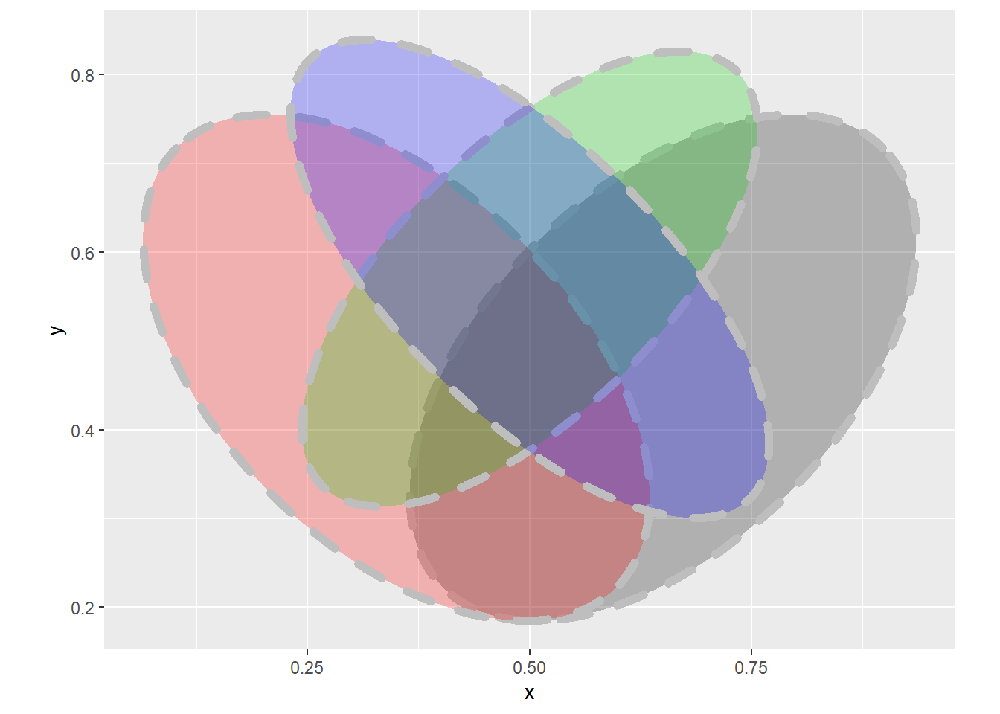
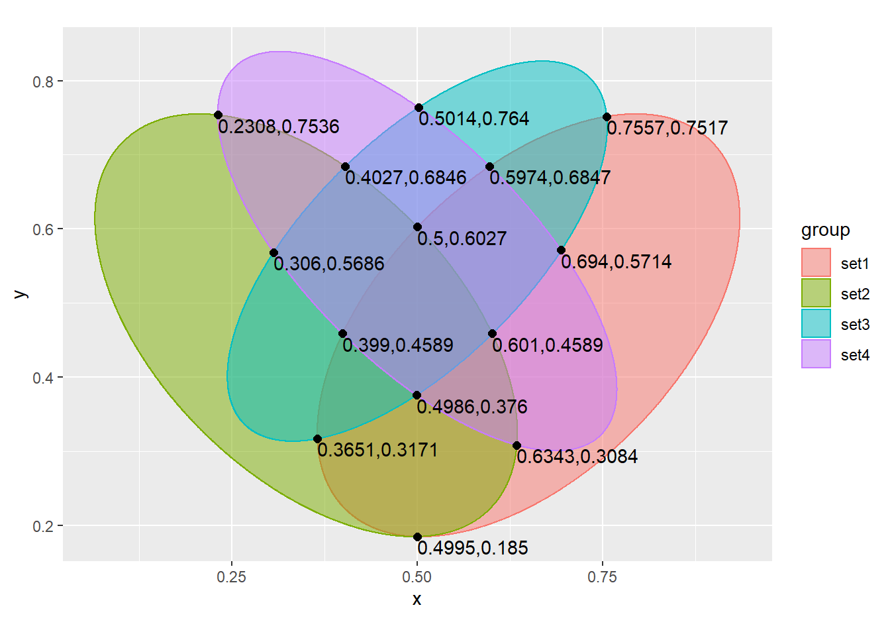
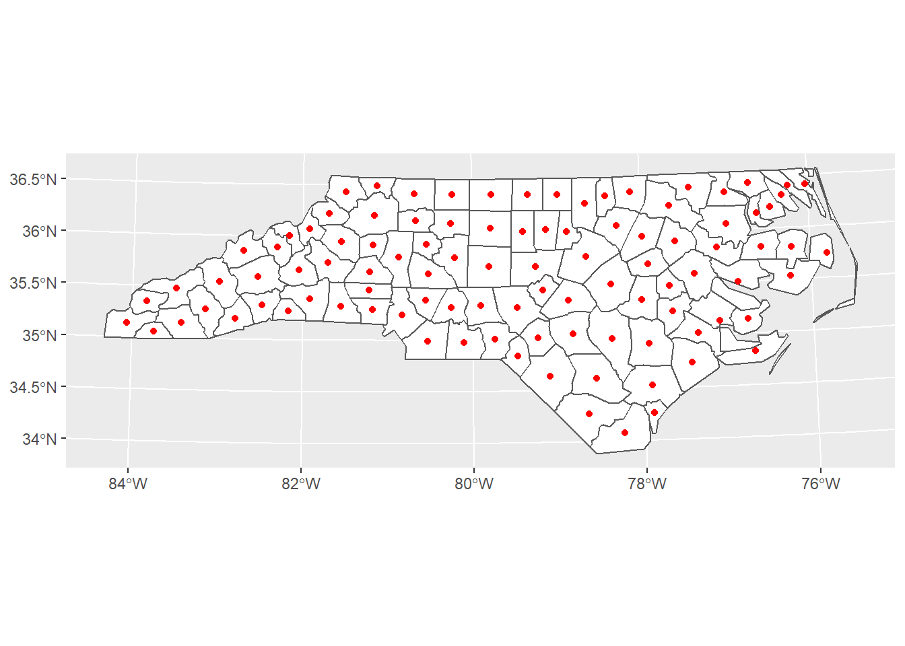
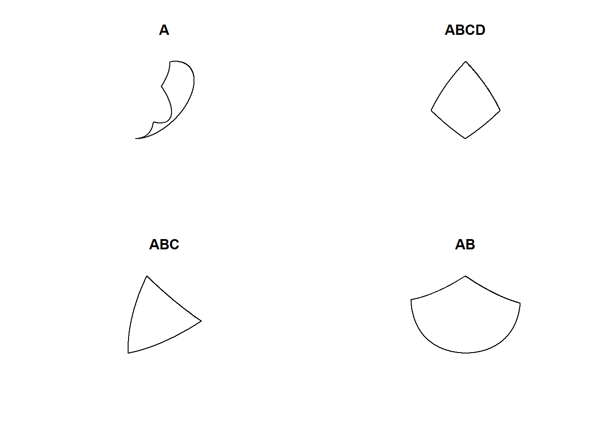
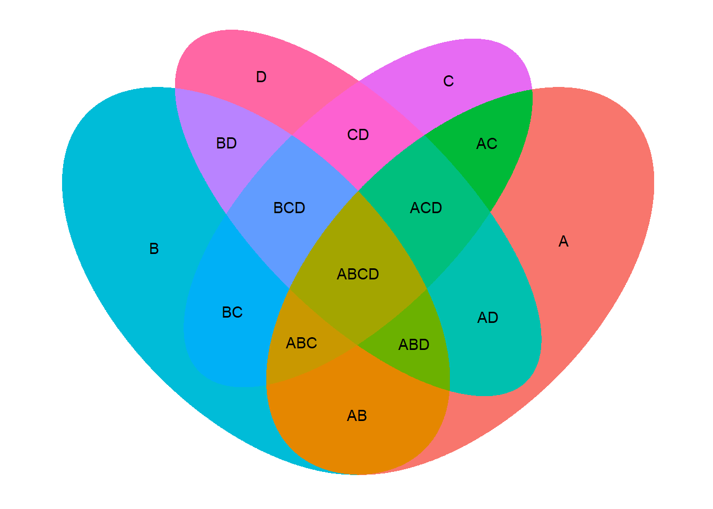

ggVennDiagram 诞生记
================

去年，我在分析 RNA-seq 数据的时候，有做 Venn 图展示结果的需要。当时，在 R 语言环境下试用了 `VennDiagram` 和
`gplots` 两个包，但是都没有达到我想要的效果。于是便有了一个想法，开发一个更好用的画 Venn 图的 R 包。

花了一些时间看了上述两个包的源代码，发现 `VennDiagram` 的功能是挺完善的，但就是用起来很难配置。当时想，一个更好的 Venn
Diagram 应该是支持 ggplot 语法的，于是先起了个名字，就叫 `ggVennDiagram`。并在笔记本中做了一个备忘。

-----

## 一个 `ggVennDiagram` 包的想法

开发一个画 Venn 图的包，它可以：

  - 接受传统上的输出，输出优于 VennDiagram 和 gplots 的 Venn 图;
      - 颜色/透明度/线型/粗细等各种自定义
      - 是否固定比例：参数scaled = True。
      - 随意显示标签(label 和 text)
      - 参数：circle还是ellipse？（circle在4d venn中并不能显示所有组合）
      - 参数：color是不同色块还是按梯度填充？
  - 接受直接的 data.frame 或者 matrix 输出, 通过指定 Threshold 自行创建存在矩阵, 按列分组, 按行计数;
  - 也可以接受from list输入；
  - 如果分组过多(\>5), 则使用 upsetR 绘制多种组合条件下的无限 Venn 图.
  - Venn 图内每个空间内再分别上色.

-----

想法是好的，基本上涵盖了 `VennDiagram` 这个包中的主要功能，但是自己并没有这个能力去实现它。再加上自己又有别的事情，就放在那里了。

时间过得好快，转眼间就到了今年的6月。有一天，小丫在画图群中发布了一个 Venn
图的众筹，我感觉可以满足自己的需要。于是就购买了那个众筹，但是随后发现那幅图有两个问题：①虽然可以支持
Venn
图的各个部分填充上不同的颜色，但是需要一个个的指定，很不方便；②那个韦恩图的图形设定不好，同样的一个区域（如最左侧椭圆）被分割成了3个部分。

这个 bug 其实来自于 `colorfulVennPlot` 这个包。

## `colorfulVennPlot` 的问题

`colorfulVennPlot` 是小丫画图中使用的软件包。`colorfulVennPlot`
可以按不同区块着色，但是遗憾的是4个椭圆的参数有问题，导致出现了不该有的色块。

``` r
set.seed(20190702)
tank <- 1:100
sets <- lapply(c(10,20,30,40), function(x)sample(tank,x))
names(sets) <- LETTERS[1:4]

library(colorfulVennPlot)
```

    ## Loading required package: grid

``` r
Colors <- c('red', 'yellow', 'green', 'pink', 'darkgreen','blue','lightblue','tan',   'yellowgreen','orange','purple','white','grey','plum','brown')
regions <- seq(15)
names(regions) <- c('1000', '0100', '1100', '0010', '1010', '0110', '1110', '0001', '1001', '0101', '1101', '0011', '1011', '0111', '1111')

plotVenn4d(1:15)
```



第二个问题显然是不严谨的，于是我跟丫姐交流了这个问题，希望能够消除这个 bug 。未果。于是只能自己想办法。

当时，我已经学习了 “y叔” 关于 “要加强代码抽象化” 的指示。当我再回到 `ggVennDiagram`
的时候，开始考虑我要实现的核心功能是什么？其实也是上面的两点，第一要能够用连续变量着色的方法对
Venn
图各个区域元素数量进行着色，第二是图的形状要相对严谨。那么，在使用颜色区分的基础上，就不需要在用区域的大小来区分元素的数量。更何况当绘制
4d Venn 时事实上很难用区域面积来区分元素数量。对于数据输入，也不再苛求支持多种格式，而是仅仅去支持 list。因为 list
格式的输入最直观，最常用。

通过研究这个包的代码，我发现是其中使用椭圆的参数有问题。同样的问题，在 `VennDiagram` 中就不存在。要解决这个问题，借用
`VennDiagram` 中四个椭圆的参数设置就可以了。

## 生成 4 sets椭圆

`VennDiagram` 使用 `ell2poly` 函数来画 4 个椭圆，我把其中的参数拿出来，生成了椭圆的数据，并使用 ggplot
画了出来。

``` r
library(VennDiagram)
```

    ## Loading required package: futile.logger

``` r
library(dplyr)
```

    ## 
    ## Attaching package: 'dplyr'

    ## The following objects are masked from 'package:stats':
    ## 
    ##     filter, lag

    ## The following objects are masked from 'package:base':
    ## 
    ##     intersect, setdiff, setequal, union

``` r
sets <- 4
ellipse_4d_parameters <- list(c(0.65, 0.47, 0.35, 0.20,  45),
                              c(0.35, 0.47, 0.35, 0.20, 135),
                              c(0.50, 0.57, 0.33, 0.15,  45),
                              c(0.50, 0.57, 0.35, 0.15, 135))
ellipse_4d_coordinations <- lapply(1:sets,function(i){
  x <- ellipse_4d_parameters[[i]]
  do.call("ell2poly",as.list(c(x,n.sides=3000))) %>% 
    data.frame() %>% 
    mutate(group=paste("set",i,sep=""))
  })
df <- do.call("rbind",ellipse_4d_coordinations)
head(df)
```

    ##           x         y group
    ## 1 0.8974874 0.7174874  set1
    ## 2 0.8971906 0.7177830  set1
    ## 3 0.8968928 0.7180776  set1
    ## 4 0.8965939 0.7183711  set1
    ## 5 0.8962939 0.7186634  set1
    ## 6 0.8959929 0.7189547  set1

使用`ggplot2`的`geom_polyon()`函数画图。

``` r
library(ggplot2)
ggplot(df,aes(x,y)) + 
  geom_polygon(aes(group=group,fill=group,alpha=I(1/3))) + 
  coord_equal()
```



可以使用其它映射改变填充色，线条属性等。

``` r
ggplot(df,aes(x,y)) +
  geom_polygon(aes(group=group),color="grey",fill=rep(1:4,each=3001),alpha=1/4,size=2,lty="dashed") + 
  coord_equal()
```



那么，现在要解决的只剩下一个问题：确定每个 Venn 图区域的坐标，这样调用 `ggplot2` 的 `geom_polygon()`
函数画出图片就可以了。

## 分区着色

在`colorfulVennPlot`中，不同区域的着色是靠椭圆交点的坐标限制多边形而获得的。

这些交点和色块的中心点都是预定义的（被作者称为**硬核代码**，虽然不好看，但是能用）。

``` r
# Hard-coded crossover regions
regions <- rbind(
  data.frame(i = 1, j = 2, x = c(rep(-8.66025,3), rep(8.66025, 3)), y = 2.5,
    TF = c('0100', '1000', '1100', '0101', '1001', '1101')),
  data.frame(i = 1, j = 3, x = c(rep(0.01184, 2),rep(4.988876, 4),rep(-4.988876,4)), y = c(rep(-4.99997,2),rep(4.3333,8)),
    TF = c('1000', '1010', '0101', '0111', '1101', '1111', '0100', '0110', '1100', '1110')),
  data.frame(i = 1, j = 4, x = c(3.6852,8,9.648,rep(0,4)), y = c(-4.648,-2.9987,1.3147, rep(5, 4)),
    TF = c('1001', '1001', '1001', '0110', '0111', '1110', '1111')),
  data.frame(i = 2, j = 3, x = c(rep(-4.472,4), rep(4.472,4), rep(-4.472,3),rep(4.472,4)), y = c(rep(0.52786,8), rep(9.472, 7)),
    TF = c('1000', '1010', '1100', '1110', '1001', '1011', '1101', '1111', '0010', '0100', '0110', '0001', '0011', '0101', '0111')),
  data.frame(i = 2, j = 4, x = c(rep(0.667,8), rep(10, 2)), y = c(rep(9.989, 4), rep(0.011, 4), rep(4.969,2)),
    TF = c('0010', '0011', '0110', '0111', '1010', '1011', '1110', '1111', '0001', '0101')),
  data.frame(i = 3, j = 4, x = 2.5, y = c(rep(-3.66025, 3),rep(13.66, 3)), TF = c('1001', '1010', '1011', '0001', '0010', '0011'))
)

# Midpoints for hard-coded crossover regions
midpoints <- data.frame(
  x = c(-4.37352, -6.04042, -6.04042, -0.43516, -0.32341, -2.19859, -2.19859, 5.65737, 6.16114, 7.03031, 6.04042, 2.54627, 2.54627, 2.53192, 2.53192),
  y = c(-0.65737, 5.43516, 2.45373, 11.04042, -2.03031, 7.19859, 2.46808, 9.36716, -1.16074, 5.31864, 2.45373, 11.04042, -1.04042, 7.19859, 2.46808),
  TF = c('1000', '0100', '1100', '0010', '1010', '0110', '1110', '0001', '1001', '0101', '1101', '0011', '1011', '0111', '1111'))
```

虽然我有点不能忍受这种**硬核代码**，但是似乎也没有什么更好的解决方案。现在我要更换新的椭圆，那么需要解析新椭圆之间交点的坐标。

解析交点坐标给我的感觉就是已知4个椭圆的方程，求出交点的坐标。虽然我数学是个渣渣，但是我还是通过几天的努力，得到了新椭圆中交点的坐标。

4个椭圆共有14个交点，最终能够找出全部的14个交点的坐标。根据得出的结果，我们编一段硬代码。

``` r
s <- "AxB:0.5,0.6027;0.4995,0.185
AxC:0.7557,0.7517;0.3651,0.3171
AxD:0.5974,0.6847;0.399,0.4589
BxC:0.601,0.4589;0.4027,0.6846
BxD:0.6343,0.3084;0.2308,0.7536
CxD:0.5014,0.764;0.306,0.5686;0.4986,0.376;0.694,0.5714"
library(stringr)
library(tidyr)
crossing_points <- str_split(s,"\n") %>% 
  unlist() %>% 
  str_split(":") %>% 
  do.call("rbind",.) %>% 
  data.frame() %>% 
  separate(X1,c("set1","set2"),sep="x") %>% 
  separate_rows(X2,sep = ";") %>% 
  separate(X2,c("x","y"),sep = ",") %>% 
  mutate(x=as.numeric(x),y=as.numeric(y))
head(crossing_points)
```

    ##   set1 set2      x      y
    ## 1    A    B 0.5000 0.6027
    ## 2    A    B 0.4995 0.1850
    ## 3    A    C 0.7557 0.7517
    ## 4    A    C 0.3651 0.3171
    ## 5    A    D 0.5974 0.6847
    ## 6    A    D 0.3990 0.4589

下面作图验证。

``` r
ggplot(df,aes(x,y)) + 
  geom_polygon(aes(group=group,color=group,fill=group),alpha=0.5) +
  geom_point(data = crossing_points,color="black",size=2) +
  geom_text(aes(label=paste(x,y,sep=",")),data = crossing_points,vjust=1.2,hjust=0) +
  coord_equal()
```



显然，节点的位置定位还是非常精确的。

但是，随后我发现：**中心点的坐标我真的不会求。**

## 发现 “`sf`”

在 Google 查找计算多边形的中心点的方法的时候，我发现了一个 `sf` 包可以完成这个操作。

### “`sf`” 计算多边形的中心点

``` r
library(sf)
```

    ## Linking to GEOS 3.6.1, GDAL 2.2.3, PROJ 4.9.3

``` r
library(ggplot2)

# I transform to utm because st_centroid is not recommended for use on long/lat 
nc <- st_read(system.file('shape/nc.shp', package = "sf")) %>% 
  st_transform(32617)
```

    ## Reading layer `nc' from data source `D:\R\R_LIBS_USER\sf\shape\nc.shp' using driver `ESRI Shapefile'
    ## Simple feature collection with 100 features and 14 fields
    ## geometry type:  MULTIPOLYGON
    ## dimension:      XY
    ## bbox:           xmin: -84.32385 ymin: 33.88199 xmax: -75.45698 ymax: 36.58965
    ## epsg (SRID):    4267
    ## proj4string:    +proj=longlat +datum=NAD27 +no_defs

``` r
# using rgeos
# sp_cent <- gCentroid(as(nc, "Spatial"), byid = TRUE)

# using sf
sf_cent <- st_centroid(nc)
```

    ## Warning in st_centroid.sf(nc): st_centroid assumes attributes are constant
    ## over geometries of x

``` r
# plot both together to confirm that they are equivalent
ggplot() + 
  geom_sf(data = nc, fill = 'white') +
  # geom_sf(data = sp_cent %>% st_as_sf, color = 'blue') + 
  geom_sf(data = sf_cent, color = 'red') 
```



紧接着，我又喜出望外的发现使用 `sf` 还可以计算两个多边形之间的交集。

上面这个韦恩图总共分为14个部分，分别是A,B,C,D,AB,AC,AD,BC,BD,CD,ABC,ACD,BCD和ABCD。
他们的计算方法我上小学的时候就学过的。分别是：

A,B,C,D：\(A = A_0 - B_0 - C_0 - D_0\)
ABCD：\(ABCD = intersect(interasect(intersect(A_0,B_0),C_0),D_0)\)
ABC,ACD,BCD：\(ABC = interasect(intersect(A_0,B_0),C_0) - ABCD\)
AB,AC,AD,BC,BD,CD：\(AB=intersect(A_0,B_0) - C_0 -D_0\)

``` r
sets <- 4
parameters <- list(c(0.65, 0.47, 0.35, 0.20,  45),
                   c(0.35, 0.47, 0.35, 0.20, 135),
                   c(0.50, 0.57, 0.33, 0.15,  45),
                   c(0.50, 0.57, 0.35, 0.15, 135))
ellipses <- lapply(parameters,function(x){
  do.call(ell2poly,as.list(c(x,n.sides=3000))) %>% 
    data.frame() %>% 
    mutate(x=round(x,4),y=round(y,4))
})

polygons <- lapply(ellipses,function(x)st_polygon(list(as.matrix(x))))
```

使用 `sf` 中的方法，可以找到A的区域。

``` r
par(mfrow=c(2,2))
A <- st_difference(st_difference(st_difference(polygons[[1]],polygons[[2]]),polygons[[3]]),polygons[[4]])
plot(A,main="A")

ABCD <- st_intersection(st_intersection(st_intersection(polygons[[1]],polygons[[2]]),polygons[[3]]),polygons[[4]])
plot(ABCD,main="ABCD")

ABC <- st_difference(st_intersection(st_intersection(polygons[[1]],polygons[[2]]),polygons[[3]]),polygons[[4]])
plot(ABC,main = "ABC")

AB <- st_difference(st_intersection(polygons[[1]],polygons[[2]]),st_union(polygons[[3]],polygons[[4]]))
plot(AB, main = "AB")
```



## 开始确定参数

``` r
library(sf)
A <- st_difference(st_difference(st_difference(polygons[[1]],polygons[[2]]),polygons[[3]]),polygons[[4]])
B <- st_difference(st_difference(st_difference(polygons[[2]],polygons[[1]]),polygons[[3]]),polygons[[4]])
C <- st_difference(st_difference(st_difference(polygons[[3]],polygons[[1]]),polygons[[2]]),polygons[[4]])
D <- st_difference(st_difference(st_difference(polygons[[4]],polygons[[1]]),polygons[[3]]),polygons[[2]])
AB <- st_difference(st_intersection(polygons[[1]],polygons[[2]]),st_union(polygons[[3]],polygons[[4]]))
AC <- st_difference(st_intersection(polygons[[1]],polygons[[3]]),st_union(polygons[[2]],polygons[[4]]))
AD <- st_difference(st_intersection(polygons[[1]],polygons[[4]]),st_union(polygons[[3]],polygons[[2]]))
BC <- st_difference(st_intersection(polygons[[3]],polygons[[2]]),st_union(polygons[[1]],polygons[[4]]))
BD <- st_difference(st_intersection(polygons[[4]],polygons[[2]]),st_union(polygons[[3]],polygons[[1]]))
CD <- st_difference(st_intersection(polygons[[3]],polygons[[4]]),st_union(polygons[[1]],polygons[[2]]))
ABC <- st_difference(st_intersection(st_intersection(polygons[[1]],polygons[[2]]),polygons[[3]]),polygons[[4]])
ABD <- st_difference(st_intersection(st_intersection(polygons[[1]],polygons[[2]]),polygons[[4]]),polygons[[3]])
ACD <- st_difference(st_intersection(st_intersection(polygons[[1]],polygons[[4]]),polygons[[3]]),polygons[[2]])
BCD <- st_difference(st_intersection(st_intersection(polygons[[4]],polygons[[2]]),polygons[[3]]),polygons[[1]])
ABCD <- st_intersection(st_intersection(st_intersection(polygons[[1]],polygons[[2]]),polygons[[3]]),polygons[[4]])
```

计算多边形的参数。

``` r
ggpolygons <- list(A=A,B=B,C=C,D=D,AB=AB,AC=AC,AD=AD,BC=BC,BD=BD,CD=CD,ABC=ABC,ABD=ABD,ACD=ACD,BCD=BCD,ABCD=ABCD)
polygon_names <- names(ggpolygons)
ggpolygons_df <- lapply(1:length(ggpolygons), function(i){
  df <- unlist(ggpolygons[[i]]) %>% matrix(ncol = 2) %>% data.frame()
  colnames(df) <- c("x","y")
  df$group <- polygon_names[[i]]
  return(df)
})
data_ploygons <- do.call(rbind,ggpolygons_df)
```

计算多边形中心点。

``` r
center_df <- lapply(ggpolygons, st_centroid) %>% unlist %>% matrix(byrow = T,ncol=2) %>% data.frame()
center_df$group <- polygon_names
colnames(center_df) <- c("x","y","group")
data_centers <- center_df
```

查看一下结果：

``` r
ggplot(data_ploygons,aes(x,y,fill=group)) +
  geom_polygon(show.legend = F) +
  geom_text(aes(label=group),data=data_centers) +
  coord_equal() +
  ggtree::theme_tree()
```

    ## Registered S3 method overwritten by 'treeio':
    ##   method     from
    ##   root.phylo ape



有了这些结果，`ggVennDiagram` 基本突破了最初的困境， 设计思路也越来越明确了。这个包支持 list 格式的输入，并根据 list
的长度和其中所含的元素，分别确定韦恩图的关键参数。7月初，我首先实现了 4 sets
韦恩图，并且发到了“小丫画图群”和“biobabble作者群”听取意见，不过都石沉大海，波澜不惊。

然而，因为我实在没有发现有任何一个包能够实现我这里的功能，所以并没有放弃。在听取了y叔 “写 R
包的十条建议”之后，我进一步增强了代码的复用性，优化了代码的逻辑，添加了对更简单的
2-3 sets 韦恩图的支持，最后编写了软件包的文档，成为了一个名副其实的 `ggVennDiagram`。把它 push 到了 GitHub
上，并且提交到 CRAN。

这个完成度比较高的作品出现以后，很快引起了y叔的关注，他觉得不错，并希望我说一下写这个包的故事。恰好，CRAN
的提交出了一些问题，于是我请他帮忙看一下，他欣然同意并帮助修改了
DESCRIPTION 文件。

`ggVennDiagram` 说起来算是我参与创作的第二个R包了。第一个是 `rvcheck`，当时我只是贡献了几行代码，便上了 y叔 的
contributor。而 `ggVennDiagram` 这样一个作品多次受到余教授的启发和实质性帮助，我决定将余教授加入
contributor 中（虽然一样是我占便宜）。

`ggVennDiagram` 现在的状态，CRAN 应该很快就会收录了。这个项目在
[GitHub](https://github.com/gaospecial/ggVennDiagram)
上也有了十几个星星（被大V转发后的效应太明显）。`ggVennDiagram`
应该是目前唯一能够实现韦恩图分区按数量自动着色的一个软件。怎么说呢，真正能够解决那么一个小问题，大家都还是受用的。当然，我也很受用。哈哈\~
