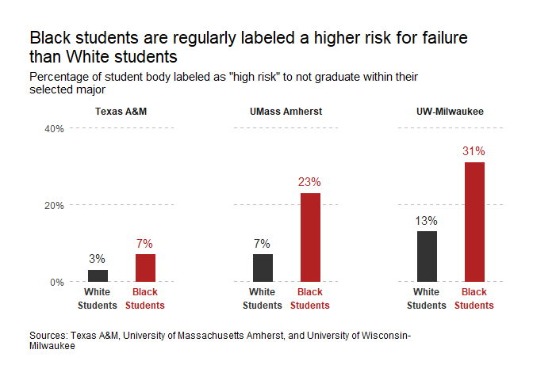

    library(tidyverse)

## Day 1: `case_when()` 的用法

    GDP_province %>%
      mutate(
        province = cash_when(
          str_detect(., "宁夏") ~ "宁夏自治区",
          str_detect(., "新疆") ~ "新疆自治区",
          TRUE ~ .
        )
      )

## Day 2

按 `score` 排序，但是 `all` 总在最下面一行。

    d2 <- tribble(
      ~name, ~score,
      "a1",    2,
      "a2",    5,
      "a3",    3,
      "a4",    7,
      "a5",    6,
      "all",   23
    )

    # solution by @王敏杰
    d2 %>%
      arrange(desc(score)) %>%
      arrange(name %in% "all")

    ## # A tibble: 6 x 2
    ##   name  score
    ##   <chr> <dbl>
    ## 1 a4        7
    ## 2 a5        6
    ## 3 a2        5
    ## 4 a3        3
    ## 5 a1        2
    ## 6 all      23

## Day 3

统计每个学生成绩高于各科平均值的个数。

    d3 <- tribble(
      ~name,   ~chinese, ~english, ~physics,
      "Alice", 85,       56,       88,
      "Bob",   77,       66,       55,
      "Cave",  59,       77,       68,
      "Dab",   86,       91,       69
    )

结果如下：

    # solution by @王敏杰
    d3 %>%
      mutate(
        across(-name, list(RC = ~ . > mean(.)))
      ) %>%
      rowwise() %>%
      mutate(
        num_above_mean = sum(c_across(ends_with("_RC")))
      ) %>%
      ungroup() %>%
      select(-ends_with("_RC"))

    ## # A tibble: 4 x 5
    ##   name  chinese english physics num_above_mean
    ##   <chr>   <dbl>   <dbl>   <dbl>          <int>
    ## 1 Alice      85      56      88              2
    ## 2 Bob        77      66      55              1
    ## 3 Cave       59      77      68              1
    ## 4 Dab        86      91      69              2

## Day 4

    data <- tribble(
      ~id, ~corr, ~period,
      1, 0, "a",
      1, 0, "b",
      2, 0, "a",
      2, 1, "b",
      3, 1, "a",
      3, 0, "b",
      4, 1, "a",
      4, 1, "b"
    )
    data

    ## # A tibble: 8 x 3
    ##      id  corr period
    ##   <dbl> <dbl> <chr> 
    ## 1     1     0 a     
    ## 2     1     0 b     
    ## 3     2     0 a     
    ## 4     2     1 b     
    ## 5     3     1 a     
    ## 6     3     0 b     
    ## 7     4     1 a     
    ## 8     4     1 b

先按 id 分组， - 如果corr中都是0 就none - 如果corr中都是1 就both -
如果corr中只有一个1 就输出1对应period

    # solution by @王敏杰, modified
    my_function <- function(corr, period){
      sum <- sum(corr)
      
      if (sum == 0) res <- 'none'
      if (sum == 2) res <- 'both'
      if (sum == 1) res <- period[corr == 1]
      
      return(res)
    }

    data %>% group_by(id) %>%
      summarize(resp_period = my_function(corr, period))

    ## # A tibble: 4 x 2
    ##      id resp_period
    ##   <dbl> <chr>      
    ## 1     1 none       
    ## 2     2 b          
    ## 3     3 a          
    ## 4     4 both

## Day 5：ggplot 作图

重复下图：

    # day 05
    # ggplot作图
    # Data by @鼠大米

    pass_risk <- tibble::tribble(
      ~college,        ~students,          ~rate,
      'Texas A&M',    'White Students',    0.03,
      'Texas A&M',    'Black Students',    0.07,
      'UMass Amherst',    'White Students',    0.07,
      'UMass Amherst',    'Black Students',    .23,
      'UW-Milwaukee',    'White Students',    .13,
      'UW-Milwaukee',    'Black Students',    .31
    )

    # Plot
    library(ggplot2)
    ggplot(pass_risk,aes(forcats::fct_rev(students),rate,fill=students, color=students)) +
      geom_col(width = 0.4) +
      geom_text(aes(label=paste0(round(rate*100),"%")), vjust = -0.8) +
      facet_wrap(~college, nrow=1) +
      scale_x_discrete(labels = function(x) gsub(" ","\n",x)) +
      scale_y_continuous(labels = function(x) paste0(round(x*100),"%"),
                         breaks = c(0,0.2,0.4),
                         limits = c(0,0.4)) +
      scale_fill_manual(values = c("White Students" = "grey20","Black Students" = "firebrick")) +
      scale_color_manual(values = c("White Students" = "grey20","Black Students" = "firebrick")) +
      labs(x="",y="",
           title = "Black students are regularly labeled a higher risk for failure\nthan White students",
           subtitle = "Percentage of student body labeled as \"high risk\" to not graduate within their\nselected major",
           caption = "Sources: Texas A&M, University of Massachusetts Amherst, and University of Wisconsin-\nMilwaukee") +
      theme(legend.position = "none",
            plot.title = element_text(size = rel(1.5)),
            plot.title.position = "plot",
            plot.caption.position = "plot",
            plot.caption = element_text(hjust = 0),
            plot.margin = margin(1,1,1,1,"cm"),
            strip.background = element_blank(),
            strip.text = element_text(face = "bold"),
            panel.background = element_rect(fill = NA),
            panel.grid.major.y = element_line(color = "grey", linetype = "dashed"),
            panel.spacing.x =  unit(2,"cm"),
            axis.ticks = element_blank(),
            axis.text.x = element_text(color = c("grey20","firebrick"),
                                       lineheight = unit(1.2,"line"),
                                       face = "bold",
                                       margin = margin(t = -5,"pt"))
            )

### 配色问题

可以用这个取色：<https://color.adobe.com/zh/create/image-gradient>

    # 看一下效果
    colorspace::swatchplot(c("#F42F5D","#252A4A"))

